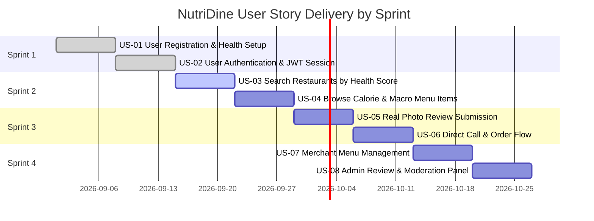

# User Stories & Acceptance Criteria

## NutriDine Platform
**Document Version:** 1.0.0  
**Course:** 192-304 Agile Software Development  
**Methodology:** Agile / Scrum with Behavior-Driven Development (BDD)  
**Status:** Approved for Sprint Planning  

---

## 1. Scrum Quality Standards

### 1.1 Definition of Ready (DoR)
A User Story is considered **Ready for Sprint Backlog** when:
- [x] Written in standard Agile format: *"As a [User], I want [Feature], so that [Benefit]"*.
- [x] Clear Acceptance Criteria defined in BDD *Given-When-Then* structure.
- [x] Estimated in Story Points using Planning Poker (Fibonacci scale: 1, 2, 3, 5, 8, 13).
- [x] All external dependencies identified and available.
- [x] UI mockups or user flow wireframes provided.

### 1.2 Definition of Done (DoD)
A User Story is considered **Done** and ready for Sprint Review when:
- [x] All Acceptance Criteria have passed verification.
- [x] Unit and Integration tests written and achieving $\ge 80\%$ code coverage.
- [x] Code peer-reviewed and merged into the main branch via Pull Request.
- [x] No high-severity static analysis or linting errors.
- [x] Responsive on desktop (1920x1080) and mobile (375x667) screen viewports.
- [x] Deployed and verifiable in the staging/demo environment.

---

## 2. Product Backlog & User Story Matrix

| Story ID | User Story Title | Priority | Story Points | Sprint |
| :--- | :--- | :---: | :---: | :---: |
| **US-01** | User Registration & Health Profile Setup | Must | 5 | Sprint 1 |
| **US-02** | User Login & JWT Session Management | Must | 3 | Sprint 1 |
| **US-03** | Search Nearby Restaurants by Health Score | Must | 5 | Sprint 2 |
| **US-04** | Nutritional Menu Catalog & Calorie Breakdown | Must | 5 | Sprint 2 |
| **US-05** | Community Rating & Photo Upload Review | Should | 8 | Sprint 3 |
| **US-06** | Direct Call / Order Inquiry Generation | Must | 3 | Sprint 3 |
| **US-07** | Merchant Menu Management (CRUD) | Should | 5 | Sprint 4 |
| **US-08** | Admin Content Moderation & Verification | Could | 3 | Sprint 4 |

---

## 3. Detailed User Stories & Acceptance Criteria (Gherkin Format)

### US-01: User Registration & Health Profile Setup
**As a** health-conscious consumer,  
**I want to** create an account with my dietary preferences and daily calorie target,  
**So that** the application can highlight meals tailored to my fitness goals.

* **Scenario 1: Successful Registration with Valid Data**
  * **Given** I am an unregistered visitor on the registration page,
  * **When** I fill in valid fields (Name: "Sarah Connor", Email: "sarah@example.com", Password: "SecurePassword123!", Calorie Target: 1800),
  * **And** I click the "Create Account" button,
  * **Then** my account is saved to the database with a hashed password,
  * **And** I receive a success notification and an automated redirection to the Dashboard.

* **Scenario 2: Registration Fails with Duplicate Email**
  * **Given** an existing user exists with email `"sarah@example.com"`,
  * **When** a new registration is submitted with `"sarah@example.com"`,
  * **Then** the registration is rejected with status `409 Conflict`,
  * **And** the UI displays an error: *"An account with this email address already exists."*

---

### US-02: User Login & JWT Session Management
**As a** registered user,  
**I want to** log in securely using my email and password,  
**So that** I can access my personalized calorie dashboard and submit reviews.

* **Scenario 1: Valid Login Credentials**
  * **Given** I am on the login screen with valid registered credentials,
  * **When** I submit my registered email and matching password,
  * **Then** the backend returns an HTTP `200 OK` with a valid JWT access token,
  * **And** my profile avatar and customized calorie budget display in the top navigation bar.

* **Scenario 2: Invalid Password Entry**
  * **Given** I am on the login screen,
  * **When** I enter a valid email but an incorrect password,
  * **Then** the backend returns an HTTP `401 Unauthorized`,
  * **And** the UI displays: *"Invalid email or password. Please try again."*

---

### US-03: Search Restaurants by Distance & Healthy Score
**As a** hungry diner,  
**I want to** discover nearby restaurants filtered by distance and obesity-friendly/health ratings,  
**So that** I can find nourishing food options within walking or short driving distance.

* **Scenario 1: Filter Restaurants by Maximum Distance and Minimum Health Score**
  * **Given** I enable location permissions on the Discovery page,
  * **When** I set the distance filter to $\le 5\text{ km}$ and health score $\ge 4.0\text{ stars}$,
  * **Then** the restaurant list updates in $< 300\text{ ms}$ showing only matching restaurants,
  * **And** each restaurant card displays its distance (e.g. "1.2 km"), health star badge, and average calorie rating.

* **Scenario 2: No Restaurants Found in Filter Criteria**
  * **Given** no restaurants exist within 1 km having a 5.0-star rating,
  * **When** I apply the filter $\le 1\text{ km}$ and $\text{score} = 5.0$,
  * **Then** the system displays a friendly empty state: *"No healthy spots found in this immediate radius. Try expanding your search distance."*

---

### US-04: View Restaurant Menu with Calorie & Macro Breakdown
**As a** diner monitoring my macronutrients,  
**I want to** view a restaurant’s menu with itemized calories, protein, carbs, and fats,  
**So that** I can pick dishes that fit my remaining daily caloric budget.

* **Scenario 1: Menu Item Detailed Display**
  * **Given** I select "Green Garden Bistro" from the restaurant list,
  * **When** the menu view loads,
  * **Then** each dish card lists its price, calorie count (e.g. "420 kcal"), and macro split (Protein: 35g, Carbs: 25g, Fat: 8g),
  * **And** dishes under 500 kcal display a green "Low Calorie" badge.

* **Scenario 2: Daily Budget Highlight**
  * **Given** I am logged in with 600 kcal remaining in my daily budget,
  * **When** viewing the menu,
  * **Then** dishes with $\le 600\text{ kcal}$ display an indicator: *"Fits your remaining budget"*.

---

### US-05: Real Photo Review & Rating Submission
**As a** customer who ordered food,  
**I want to** submit a star rating, honest comment, and real photo of the delivered dish,  
**So that** the community can verify the actual quality and appearance of the meal.

* **Scenario 1: Successful Review with Photo Upload**
  * **Given** I am an authenticated user on the restaurant details page,
  * **When** I choose a 5-star rating, enter a text review $\ge 10$ characters, and upload a valid `.jpg/.png` image ($\le 5\text{ MB}$),
  * **And** click "Submit Review",
  * **Then** the image is uploaded to cloud storage,
  * **And** my review is appended to the review feed immediately with my name and timestamp.

* **Scenario 2: Photo Exceeds Maximum File Size Limit**
  * **Given** I attempt to upload a photo file of size $12\text{ MB}$,
  * **When** I attach the file,
  * **Then** the client displays a validation error: *"File size exceeds 5MB limit. Please choose a smaller photo."*,
  * **And** the submission is blocked before upload.

---

### US-06: Direct Contact / Call to Order Food
**As a** customer ready to place an order,  
**I want to** click a single button to initiate a phone call with the restaurant,  
**So that** I can place my order quickly without navigating complex checkout steps.

* **Scenario 1: Triggering Click-to-Call on Mobile**
  * **Given** I am on a mobile device viewing "Yoshinoya Healthy Bowls",
  * **When** I tap the "Call Restaurant" button,
  * **Then** the device dialer opens populated with the restaurant's validated phone number (e.g. `tel:0234839948`).

* **Scenario 2: Desktop Interaction**
  * **Given** I am on a desktop browser,
  * **When** I hover or click on the "Call Restaurant" button,
  * **Then** a modal opens displaying the full phone number with a "Copy to Clipboard" shortcut and QR code.

---

## 4. Edge Cases & Error Handling Criteria

| Scenario ID | Edge Case | Expected System Handling |
| :--- | :--- | :--- |
| **EC-01** | Geolocation permission denied by browser | Fallback to default city center (Bangkok Downtown) with an interactive location search bar. |
| **EC-02** | User session token expired during review submission | Save review text draft in `localStorage`, prompt user to re-authenticate, and auto-submit upon successful login. |
| **EC-03** | Special character injection in search field | Sanitize input against XSS and SQL injection attacks; perform parameterized search queries. |

