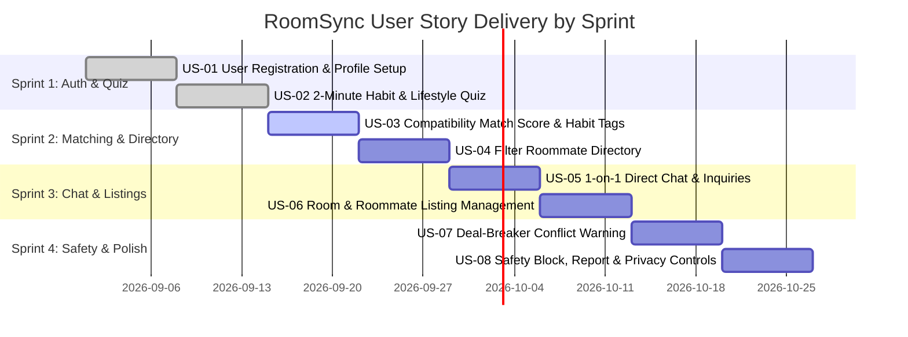

# User Stories & Acceptance Criteria

## RoomSync Platform (Behavior-Based Roommate Matching Web App)
**Document Version:** 1.0.0  
**Course:** 192-304 Agile Software Development  
**Methodology:** Agile / Scrum with Behavior-Driven Development (BDD)  
**Status:** Approved for Sprint Planning  

---

## 1. Scrum Quality Standards

### 1.1 Definition of Ready (DoR)
A User Story is considered **Ready for Sprint Backlog** when:
- [x] Written in standard user story syntax: *"As a [User Persona], I want [Feature / Action], so that [Benefit / Value]"*.
- [x] Acceptance criteria explicitly specified in Gherkin *Given-When-Then* structure.
- [x] Story points estimated using Planning Poker (Fibonacci scale: 1, 2, 3, 5, 8, 13).
- [x] Technical dependencies and database table prerequisites identified.
- [x] UI/UX flow or wireframe layout defined.

### 1.2 Definition of Done (DoD)
A User Story is considered **Done** and ready for Sprint Review when:
- [x] All defined Acceptance Criteria pass automated or manual verification.
- [x] Unit and integration tests written and passing with $\ge 80\%$ code coverage.
- [x] Code passes linting and static analysis without critical errors.
- [x] Peer code review completed and approved in GitHub Pull Request.
- [x] UI responsive across mobile (375px) and desktop (1440px) viewports.
- [x] Deployed and verified on the staging/demo deployment environment.

---

## 2. Product Backlog & User Story Matrix

| Story ID | User Story Title | Priority | Story Points | Sprint |
| :--- | :--- | :---: | :---: | :---: |
| **US-01** | User Registration & Profile Creation | Must Have | 3 | Sprint 1 |
| **US-02** | 2-Minute Habit & Lifestyle Assessment Quiz | Must Have | 5 | Sprint 1 |
| **US-03** | Behavioral Compatibility Score & Tag Breakdown | Must Have | 5 | Sprint 2 |
| **US-04** | Filtered Roommate Directory by Budget & Match % | Must Have | 5 | Sprint 2 |
| **US-05** | 1-on-1 Direct Messaging & Inquiry Chat | Must Have | 8 | Sprint 3 |
| **US-06** | Create and Manage Room Postings ("Have" / "Need") | Should Have | 5 | Sprint 3 |
| **US-07** | Deal-Breaker Detection & Conflict Alerting | Should Have | 3 | Sprint 4 |
| **US-08** | Profile Safety, User Block & Reporting System | Must Have | 3 | Sprint 4 |

---

## 3. Detailed User Stories & Acceptance Criteria (Gherkin BDD Format)

### US-01: User Registration & Profile Creation
**As a** student or renter looking for housing,  
**I want to** create a secure account with my basic bio, budget range, and preferred move-in area,  
**So that** I can build my identity on the platform and begin searching for compatible roommates.

* **Scenario 1: Successful User Registration**
  * **Given** I am a new visitor on the registration page,
  * **When** I enter a valid email (`alex.student@example.com`), password (`SecurePass2026!`), full name (`Alex Chen`), and preferred move-in district (`Downtown Campus`),
  * **And** I click "Register Account",
  * **Then** my account is saved to the database with a salted hashed password,
  * **And** a valid JWT token is returned, redirecting me to the 2-Minute Habit Quiz onboarding.

* **Scenario 2: Duplicate Email Rejection**
  * **Given** a registered user already exists with email `alex.student@example.com`,
  * **When** a new user attempts registration with the same email,
  * **Then** the system returns HTTP `409 Conflict`,
  * **And** the UI displays an error message: *"An account with this email address already exists. Please log in."*

---

### US-02: 2-Minute Habit & Lifestyle Assessment Quiz
**As a** registered user,  
**I want to** complete an intuitive 5-question lifestyle questionnaire,  
**So that** the platform understands my daily routines, sleep habits, cleanliness expectations, and guest rules.

* **Scenario 1: Complete and Save Lifestyle Assessment**
  * **Given** I am an authenticated user taking the Habit Quiz,
  * **When** I select my sleep cycle (*"Night Owl - Sleep after 1:00 AM"*), cleanliness rating (*"4 - Tidy & clean daily"*), guest policy (*"Occasional weekend guests only"*), noise level (*"Moderate / Study friendly"*), smoking (*"Non-smoker"*), and pets (*"Pet friendly"*),
  * **And** I click "Complete & Find Matches",
  * **Then** my habit vector is saved to the database,
  * **And** my profile status changes to `"Quiz Completed"`, unlocking the roommate directory.

* **Scenario 2: Incomplete Quiz Submission Validation**
  * **Given** I am on question 3 of the habit assessment,
  * **When** I try to skip mandatory questions without selecting an option,
  * **Then** the UI disables the "Next / Finish" button and highlights unselected items with: *"Please choose an option to continue."*

---

### US-03: Behavioral Compatibility Match Score & Habit Tag Highlights
**As a** prospective renter browsing candidate profiles,  
**I want to** see an overall compatibility percentage score and aligned habit tags,  
**So that** I can immediately identify whether our day-to-day living habits match before messaging.

* **Scenario 1: High Compatibility Display ($\ge 80\%$)**
  * **Given** my habit profile is configured as a Night Owl with Cleanliness Level 4,
  * **When** I view candidate profile "Jordan Lee" whose habits are also Night Owl and Cleanliness Level 4,
  * **Then** the profile displays an overall match badge with a green score $\ge 85\%$,
  * **And** highlights positive habit chips: `[Both Night Owls]`, `[Aligned Cleaning Standards]`, `[Similar Guest Rules]`.

* **Scenario 2: Low Compatibility Display ($< 50\%$)**
  * **Given** my profile is set to Early Riser (5:30 AM wake) and Quiet Sanctuary (Level 1 noise),
  * **When** I view a candidate who is a Late-Night Gamer (3:00 AM sleep) with High Social Party tolerance (Level 3),
  * **Then** the compatibility engine displays a lower score (e.g. $42\%$) with amber/slate tags indicating schedule disparity: `[Divergent Sleep Hours]`, `[Opposing Noise Tolerance]`.

---

### US-04: Filter Roommate Directory by Budget, Location, and Min Compatibility %
**As a** room seeker with a strict budget,  
**I want to** filter candidate profiles by maximum rent budget, location, and minimum match score ($\ge 80\%$),  
**So that** I only spend time evaluating candidates who meet both my financial and lifestyle criteria.

* **Scenario 1: Applying Multi-Criteria Search Filters**
  * **Given** I am on the Roommate Discovery directory,
  * **When** I set Location filter to `"University West"`, Budget to `"Max $700/mo"`, and Minimum Match to `"80%+"`,
  * **Then** the directory updates within $< 200\text{ ms}$, displaying only candidates matching all three conditions,
  * **And** displays the count of matching candidates (e.g., *"14 Compatible Roommates Found"*).

* **Scenario 2: No Matching Candidates in Strict Radius**
  * **Given** no candidates meet the filter criteria of $95\%$ match and $\le \$300\text{ budget}$,
  * **When** the search query executes,
  * **Then** the page displays a helpful empty state: *"No roommates match all strict criteria. Try expanding your budget range or lowering the match threshold."*

---

### US-05: 1-on-1 Direct Messaging & Inquiry Chat
**As a** matched roommate candidate,  
**I want to** send private direct messages to another user within the application,  
**So that** we can discuss room availability, agree on house rules, and schedule an apartment walkthrough.

* **Scenario 1: Sending and Receiving a Message**
  * **Given** I am on candidate "Maya's" profile with an $88\%$ match,
  * **When** I click "Message Roommate" and send *"Hi Maya, noticed we both keep early morning routines. Is your 2BR spot still open?"*,
  * **Then** a conversation record is created,
  * **And** the message appears immediately in the chat thread with a timestamp and `"Delivered"` status.

* **Scenario 2: Real-time Message Notification**
  * **Given** user Maya is logged into the application on another device,
  * **When** Alex sends a direct message,
  * **Then** Maya's navigation bar displays an unread message badge indicator in $< 500\text{ ms}$.

---

### US-06: Room & Roommate Listing Management
**As a** tenant with an open bedroom,  
**I want to** create a room listing with rent price, photos, amenities, and move-in date,  
**So that** seekers can view both the physical space and my behavioral profile together.

* **Scenario 1: Creating a Room Listing**
  * **Given** I am an authenticated user who selected housing status `"Has a Room"`,
  * **When** I input room title (*"Private Room near Metro"*), monthly rent (*$650*), deposit (*$650*), available date (*"2026-10-01"*), and upload 2 photos,
  * **And** click "Publish Listing",
  * **Then** the room listing is published to the directory, linked directly to my verified habit profile.

---

### US-07: Deal-Breaker Detection & Conflict Alerting
**As a** non-smoker with pet allergies,  
**I want to** be warned if a candidate has conflicting non-negotiable living habits,  
**So that** I avoid awkward conversations and dangerous living situations.

* **Scenario 1: Deal-Breaker Warning Flagging**
  * **Given** my profile specifies `"Strict Non-Smoker"` and `"No Pets (Allergic)"`,
  * **When** I view a profile of a user who marked `"Indoor Smoker"` or `"Has 2 Cats"`,
  * **Then** the profile header shows a prominent warning badge: `⚠️ Conflicting House Rules: Smoking / Pets`,
  * **And** the overall match score is adjusted with a penalty to reflect the hard deal-breaker.

---

### US-08: Safety Block, Report & Privacy Controls
**As a** privacy-conscious user,  
**I want to** block or report any user who sends inappropriate messages or misrepresents their identity,  
**So that** my personal safety and privacy remain protected on the platform.

* **Scenario 1: Blocking a User**
  * **Given** I am in a direct chat with an abusive user,
  * **When** I click "Block User" and confirm the modal prompt,
  * **Then** the conversation is hidden,
  * **And** the blocked user cannot view my profile or send further messages.

* **Scenario 2: Submitting a Safety Report**
  * **Given** I encounter a suspicious or scam profile,
  * **When** I click "Report Profile", select reason `"Spam / False Information"`, and submit evidence text,
  * **Then** a report record is logged in the database for administrator review with status `Pending`.

---

## 4. Edge Cases & Error Handling Criteria

| Case ID | Scenario / Edge Case | Expected System Behavior |
| :--- | :--- | :--- |
| **EC-01** | User attempts to browse roommate directory before completing the Habit Quiz | Redirect user with a banner: *"Please complete your 2-minute lifestyle quiz first so we can calculate your compatibility scores!"* |
| **EC-02** | User enters invalid budget boundaries ($\text{Min} > \text{Max}$) | Disable submit button and render field validation: *"Minimum budget cannot exceed maximum budget."* |
| **EC-03** | Network disconnect occurs while submitting habit assessment | Cache answers locally in `sessionStorage`; auto-retry upon reconnection without losing user inputs. |
| **EC-04** | Chat message exceeds maximum character length ($1,000$ characters) | Enforce client-side character counter and reject oversized payloads on the backend API with HTTP `422`. |
| **EC-05** | Image upload exceeds 5MB or contains unapproved file extensions | Display error message: *"Please upload JPEG or PNG images under 5MB."* |
