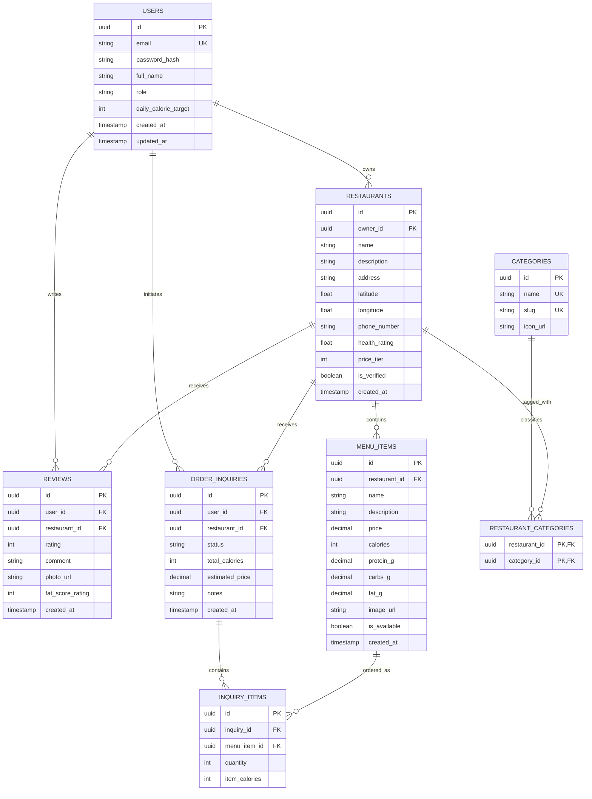

# Database Design Specification

## NutriDine Platform
**Document Version:** 1.0.0  
**Course:** 192-304 Agile Software Development  
**Target RDBMS:** PostgreSQL 16+ / SQLite 3.35+  
**Status:** Approved for Schema Migration  

---

## 1. Database Overview & Design Principles

The NutriDine database is designed following Relational Database Management System (RDBMS) 3NF (Third Normal Form) principles, balancing normalization with query performance for high-throughput restaurant discovery, menu calorie filtering, and photo review feeds.

### Key Architectural Decisions:
- **Primary Keys:** UUIDv4 / Auto-incrementing BigInt identifiers for security and distributed scalability.
- **Geospatial Support:** Floating-point coordinates (`latitude`, `longitude`) with indexed bounding box search support.
- **Nutritional Integrity:** Strict `CHECK` constraints on calorie counts and macro distributions ($calories \ge 0$, $rating \in [1, 5]$).
- **Soft Deletion & Timestamps:** `created_at` and `updated_at` timestamps across all major entities.

---

## 2. Entity-Relationship (ER) Diagram



---

## 3. Data Dictionary & Table Definitions

### 3.1 Table: `users`
Stores user profile information, authentication credentials, and personalized daily calorie goals.

| Column | Data Type | Constraints | Description |
| :--- | :--- | :--- | :--- |
| `id` | `UUID` / `BIGINT` | `PRIMARY KEY` | Unique identifier for user |
| `email` | `VARCHAR(255)` | `NOT NULL`, `UNIQUE` | User email address for authentication |
| `password_hash` | `VARCHAR(255)` | `NOT NULL` | Bcrypt/Argon2 hashed password |
| `full_name` | `VARCHAR(100)` | `NOT NULL` | Display name of the user |
| `role` | `VARCHAR(20)` | `NOT NULL`, `DEFAULT 'customer'` | `customer`, `merchant`, `admin` |
| `daily_calorie_target` | `INTEGER` | `DEFAULT 2000`, `CHECK(target > 500)` | Target daily intake in kcal |
| `created_at` | `TIMESTAMP WITH TIME ZONE`| `DEFAULT CURRENT_TIMESTAMP` | Account registration timestamp |
| `updated_at` | `TIMESTAMP WITH TIME ZONE`| `DEFAULT CURRENT_TIMESTAMP` | Profile update timestamp |

---

### 3.2 Table: `restaurants`
Contains merchant profile, location coordinates, contact details, and aggregated healthy scores.

| Column | Data Type | Constraints | Description |
| :--- | :--- | :--- | :--- |
| `id` | `UUID` / `BIGINT` | `PRIMARY KEY` | Unique restaurant ID |
| `owner_id` | `UUID` / `BIGINT` | `REFERENCES users(id)` | Associated merchant user ID |
| `name` | `VARCHAR(150)` | `NOT NULL` | Restaurant trading name |
| `description` | `TEXT` | `NULL` | Bio, health philosophy, cuisine details |
| `address` | `VARCHAR(255)` | `NOT NULL` | Physical street address |
| `latitude` | `DECIMAL(10, 7)` | `NOT NULL` | Geolocation latitude coordinate |
| `longitude` | `DECIMAL(10, 7)` | `NOT NULL` | Geolocation longitude coordinate |
| `phone_number` | `VARCHAR(20)` | `NOT NULL` | Direct phone number for orders |
| `health_rating` | `DECIMAL(3, 2)` | `DEFAULT 5.00`, `CHECK(rating >= 1 AND rating <= 5)` | 1.0 to 5.0 score |
| `price_tier` | `SMALLINT` | `DEFAULT 1`, `CHECK(price_tier BETWEEN 1 AND 4)` | $ to $$$$ indicators |
| `is_verified` | `BOOLEAN` | `DEFAULT FALSE` | True if verified by platform admin |
| `created_at` | `TIMESTAMP WITH TIME ZONE`| `DEFAULT CURRENT_TIMESTAMP` | Record creation timestamp |

---

### 3.3 Table: `categories` & `restaurant_categories`
Supports multi-tag filtering (e.g. "Low Calorie", "Keto", "High Protein", "Salads", "Clean Eating").

| Column | Data Type | Constraints | Description |
| :--- | :--- | :--- | :--- |
| `id` | `UUID` / `BIGINT` | `PRIMARY KEY` | Category identifier |
| `name` | `VARCHAR(50)` | `NOT NULL`, `UNIQUE` | Category display title |
| `slug` | `VARCHAR(50)` | `NOT NULL`, `UNIQUE` | URL-safe slug |
| `icon_url` | `VARCHAR(255)` | `NULL` | Badge icon asset link |

---

### 3.4 Table: `menu_items`
Lists individual dishes with complete calorie counts and macronutrient breakdowns.

| Column | Data Type | Constraints | Description |
| :--- | :--- | :--- | :--- |
| `id` | `UUID` / `BIGINT` | `PRIMARY KEY` | Unique dish ID |
| `restaurant_id` | `UUID` / `BIGINT` | `NOT NULL`, `REFERENCES restaurants(id) ON DELETE CASCADE` | Parent restaurant |
| `name` | `VARCHAR(120)` | `NOT NULL` | Dish name |
| `description` | `TEXT` | `NULL` | Ingredients and allergen notes |
| `price` | `DECIMAL(10, 2)` | `NOT NULL`, `CHECK(price >= 0)` | Price in local currency (THB) |
| `calories` | `INTEGER` | `NOT NULL`, `CHECK(calories >= 0)` | Total energy content in kcal |
| `protein_g` | `DECIMAL(5, 1)` | `DEFAULT 0.0`, `CHECK(protein_g >= 0)`| Protein content in grams |
| `carbs_g` | `DECIMAL(5, 1)` | `DEFAULT 0.0`, `CHECK(carbs_g >= 0)` | Carbohydrates content in grams |
| `fat_g` | `DECIMAL(5, 1)` | `DEFAULT 0.0`, `CHECK(fat_g >= 0)` | Total fat content in grams |
| `image_url` | `VARCHAR(255)` | `NULL` | Photo URL of the dish |
| `is_available` | `BOOLEAN` | `DEFAULT TRUE` | Availability flag |
| `created_at` | `TIMESTAMP WITH TIME ZONE`| `DEFAULT CURRENT_TIMESTAMP` | Created timestamp |

---

### 3.5 Table: `reviews`
Captures user star ratings, honest text feedback, verified photos, and fat content assessments.

| Column | Data Type | Constraints | Description |
| :--- | :--- | :--- | :--- |
| `id` | `UUID` / `BIGINT` | `PRIMARY KEY` | Unique review ID |
| `user_id` | `UUID` / `BIGINT` | `NOT NULL`, `REFERENCES users(id) ON DELETE CASCADE` | Author of review |
| `restaurant_id` | `UUID` / `BIGINT` | `NOT NULL`, `REFERENCES restaurants(id) ON DELETE CASCADE` | Reviewed restaurant |
| `rating` | `SMALLINT` | `NOT NULL`, `CHECK(rating BETWEEN 1 AND 5)` | Overall satisfaction |
| `comment` | `TEXT` | `NOT NULL` | Review body |
| `photo_url` | `VARCHAR(255)` | `NULL` | Customer uploaded photo URL |
| `fat_score_rating` | `SMALLINT` | `CHECK(fat_score_rating BETWEEN 1 AND 5)`| 1 = Very oily, 5 = Very clean |
| `created_at` | `TIMESTAMP WITH TIME ZONE`| `DEFAULT CURRENT_TIMESTAMP` | Review submission timestamp |

---

### 3.6 Table: `order_inquiries` & `inquiry_items`
Tracks pre-ordered dishes and aggregate calorie summaries for direct merchant contact.

| Column | Data Type | Constraints | Description |
| :--- | :--- | :--- | :--- |
| `id` | `UUID` / `BIGINT` | `PRIMARY KEY` | Inquiry ID |
| `user_id` | `UUID` / `BIGINT` | `NOT NULL`, `REFERENCES users(id)` | Customer ID |
| `restaurant_id` | `UUID` / `BIGINT` | `NOT NULL`, `REFERENCES restaurants(id)` | Target restaurant |
| `status` | `VARCHAR(20)` | `DEFAULT 'pending'` | `pending`, `contacted`, `completed` |
| `total_calories` | `INTEGER` | `NOT NULL`, `DEFAULT 0` | Aggregated calorie sum |
| `estimated_price`| `DECIMAL(10, 2)` | `NOT NULL`, `DEFAULT 0.00` | Estimated subtotal |
| `notes` | `TEXT` | `NULL` | Dietary requests (e.g. less oil) |
| `created_at` | `TIMESTAMP WITH TIME ZONE`| `DEFAULT CURRENT_TIMESTAMP` | Timestamp |

---

## 4. Indexing & Performance Optimization

```sql
-- Fast lookup for user authentication
CREATE UNIQUE INDEX idx_users_email ON users(email);

-- Geospatial spatial index for restaurant proximity search
CREATE INDEX idx_restaurants_coords ON restaurants(latitude, longitude);

-- Fast filtering by health rating and verification
CREATE INDEX idx_restaurants_health ON restaurants(health_rating DESC, is_verified);

-- Rapid menu retrieval and calorie range filtering
CREATE INDEX idx_menu_items_restaurant ON menu_items(restaurant_id);
CREATE INDEX idx_menu_items_calories ON menu_items(calories);

-- Review lookups by restaurant with sorting by recent first
CREATE INDEX idx_reviews_restaurant ON reviews(restaurant_id, created_at DESC);
```

---

## 5. SQL DDL Schema Script (PostgreSQL / SQLite Compatible)

```sql
-- Enable UUID extension if using PostgreSQL
-- CREATE EXTENSION IF NOT EXISTS "uuid-ossp";

CREATE TABLE IF NOT EXISTS users (
    id VARCHAR(36) PRIMARY KEY,
    email VARCHAR(255) NOT NULL UNIQUE,
    password_hash VARCHAR(255) NOT NULL,
    full_name VARCHAR(100) NOT NULL,
    role VARCHAR(20) DEFAULT 'customer' CHECK(role IN ('customer', 'merchant', 'admin')),
    daily_calorie_target INTEGER DEFAULT 2000 CHECK(daily_calorie_target > 500),
    created_at TIMESTAMP DEFAULT CURRENT_TIMESTAMP,
    updated_at TIMESTAMP DEFAULT CURRENT_TIMESTAMP
);

CREATE TABLE IF NOT EXISTS restaurants (
    id VARCHAR(36) PRIMARY KEY,
    owner_id VARCHAR(36) REFERENCES users(id) ON DELETE SET NULL,
    name VARCHAR(150) NOT NULL,
    description TEXT,
    address VARCHAR(255) NOT NULL,
    latitude DECIMAL(10, 7) NOT NULL,
    longitude DECIMAL(10, 7) NOT NULL,
    phone_number VARCHAR(20) NOT NULL,
    health_rating DECIMAL(3, 2) DEFAULT 5.00 CHECK(health_rating >= 1.00 AND health_rating <= 5.00),
    price_tier SMALLINT DEFAULT 1 CHECK(price_tier BETWEEN 1 AND 4),
    is_verified BOOLEAN DEFAULT FALSE,
    created_at TIMESTAMP DEFAULT CURRENT_TIMESTAMP
);

CREATE TABLE IF NOT EXISTS categories (
    id VARCHAR(36) PRIMARY KEY,
    name VARCHAR(50) NOT NULL UNIQUE,
    slug VARCHAR(50) NOT NULL UNIQUE,
    icon_url VARCHAR(255)
);

CREATE TABLE IF NOT EXISTS restaurant_categories (
    restaurant_id VARCHAR(36) REFERENCES restaurants(id) ON DELETE CASCADE,
    category_id VARCHAR(36) REFERENCES categories(id) ON DELETE CASCADE,
    PRIMARY KEY (restaurant_id, category_id)
);

CREATE TABLE IF NOT EXISTS menu_items (
    id VARCHAR(36) PRIMARY KEY,
    restaurant_id VARCHAR(36) NOT NULL REFERENCES restaurants(id) ON DELETE CASCADE,
    name VARCHAR(120) NOT NULL,
    description TEXT,
    price DECIMAL(10, 2) NOT NULL CHECK(price >= 0),
    calories INTEGER NOT NULL CHECK(calories >= 0),
    protein_g DECIMAL(5, 1) DEFAULT 0.0 CHECK(protein_g >= 0),
    carbs_g DECIMAL(5, 1) DEFAULT 0.0 CHECK(carbs_g >= 0),
    fat_g DECIMAL(5, 1) DEFAULT 0.0 CHECK(fat_g >= 0),
    image_url VARCHAR(255),
    is_available BOOLEAN DEFAULT TRUE,
    created_at TIMESTAMP DEFAULT CURRENT_TIMESTAMP
);

CREATE TABLE IF NOT EXISTS reviews (
    id VARCHAR(36) PRIMARY KEY,
    user_id VARCHAR(36) NOT NULL REFERENCES users(id) ON DELETE CASCADE,
    restaurant_id VARCHAR(36) NOT NULL REFERENCES restaurants(id) ON DELETE CASCADE,
    rating SMALLINT NOT NULL CHECK(rating BETWEEN 1 AND 5),
    comment TEXT NOT NULL,
    photo_url VARCHAR(255),
    fat_score_rating SMALLINT CHECK(fat_score_rating BETWEEN 1 AND 5),
    created_at TIMESTAMP DEFAULT CURRENT_TIMESTAMP
);

CREATE TABLE IF NOT EXISTS order_inquiries (
    id VARCHAR(36) PRIMARY KEY,
    user_id VARCHAR(36) NOT NULL REFERENCES users(id) ON DELETE CASCADE,
    restaurant_id VARCHAR(36) NOT NULL REFERENCES restaurants(id) ON DELETE CASCADE,
    status VARCHAR(20) DEFAULT 'pending' CHECK(status IN ('pending', 'contacted', 'completed', 'cancelled')),
    total_calories INTEGER NOT NULL DEFAULT 0,
    estimated_price DECIMAL(10, 2) NOT NULL DEFAULT 0.00,
    notes TEXT,
    created_at TIMESTAMP DEFAULT CURRENT_TIMESTAMP
);

CREATE TABLE IF NOT EXISTS inquiry_items (
    id VARCHAR(36) PRIMARY KEY,
    inquiry_id VARCHAR(36) NOT NULL REFERENCES order_inquiries(id) ON DELETE CASCADE,
    menu_item_id VARCHAR(36) NOT NULL REFERENCES menu_items(id) ON DELETE RESTRICT,
    quantity INTEGER NOT NULL DEFAULT 1 CHECK(quantity > 0),
    item_calories INTEGER NOT NULL
);
```

---

## 6. Seed Data for Testing & Demonstration

```sql
-- Seed Categories
INSERT INTO categories (id, name, slug, icon_url) VALUES
('cat-01', 'Low Calorie', 'low-calorie', 'https://cdn.nutridine.app/icons/low-cal.svg'),
('cat-02', 'High Protein', 'high-protein', 'https://cdn.nutridine.app/icons/protein.svg'),
('cat-03', 'Keto & Low Carb', 'keto', 'https://cdn.nutridine.app/icons/keto.svg'),
('cat-04', 'Clean Bowls', 'clean-bowls', 'https://cdn.nutridine.app/icons/salad.svg');

-- Seed Restaurants
INSERT INTO restaurants (id, name, description, address, latitude, longitude, phone_number, health_rating, price_tier, is_verified) VALUES
('rest-01', 'Green Garden Clean Bistro', 'Organic bowls and low-fat lean protein dishes.', '200 Victoria St, Bangkok', 13.756331, 100.501765, '0234839948', 4.8, 2, TRUE),
('rest-02', 'Yoshinoya Health Protein Bowls', 'Lean beef and steamed vegetables with transparent calorie tags.', 'Siam Square One, Bangkok', 13.745672, 100.534210, '026581234', 4.5, 1, TRUE);

-- Seed Menu Items
INSERT INTO menu_items (id, restaurant_id, name, description, price, calories, protein_g, carbs_g, fat_g, image_url) VALUES
('dish-01', 'rest-01', 'Grilled Chicken Avocado Salad', 'Herb-marinated lean chicken breast, organic greens, lemon dressing', 180.00, 380, 42.0, 14.0, 12.0, 'https://images.unsplash.com/photo-1546069901-ba9599a7e63c'),
('dish-02', 'rest-01', 'Salmon Quinoa Energy Bowl', 'Norwegian wild salmon, tri-color quinoa, steamed broccoli', 240.00, 490, 36.0, 45.0, 15.0, 'https://images.unsplash.com/photo-1540420773420-3366772f4999'),
('dish-03', 'rest-02', 'Lean Beef Gyudon (Low-Sodium)', 'Thin sliced premium lean beef with steamed brown rice', 175.00, 450, 28.0, 52.0, 9.0, 'https://images.unsplash.com/photo-1569718212165-3a8278d5f624');
```

