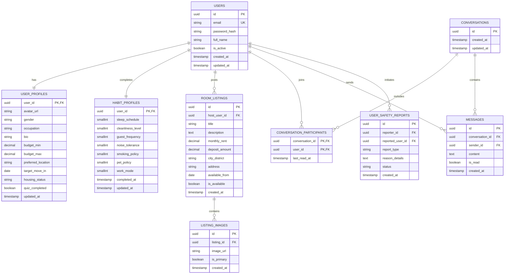

# Database Design Specification

## RoomSync Platform (Behavior-Based Roommate Matching Web App)
**Document Version:** 1.0.0  
**Course:** 192-304 Agile Software Development  
**Target RDBMS:** PostgreSQL 16+ / SQLite 3.35+  
**Status:** Approved for Schema Migration  

---

## 1. Database Overview & Architectural Principles

The RoomSync relational database is structured according to **Third Normal Form (3NF)** principles to ensure optimal data consistency, referential integrity, and sub-millisecond query execution for compatibility calculations, lifestyle filtering, and direct messaging threads.

### Key Design Principles:
1. **Normalized Lifestyle Vectors:** User behavioral habits are decoupled into dedicated attribute columns with discrete enumerated scale constraints to enable rapid mathematical vector distance comparisons.
2. **Deterministic Primary Keys:** Standardized UUID / String identifiers prevent key enumeration and facilitate distributed data sharding.
3. **Data Security & Anonymity:** Strict separation between private user authentication credentials and public profile / lifestyle habit cards.
4. **Relational Constraints & Integrity:** Cascading foreign keys for child entities (messages, listings, quiz records) and `CHECK` constraints on all habit score ranges ($1 \le \text{value} \le 5$).
5. **Comprehensive Indexing:** B-Tree and composite indexing across foreign keys, location districts, budget ranges, and conversation timestamps.

---

## 2. Entity-Relationship (ER) Diagram



---

## 3. Data Dictionary & Table Definitions

### 3.1 Table: `users`
Manages core login credentials, account status, and registration metadata.

| Column | Data Type | Constraints | Description |
| :--- | :--- | :--- | :--- |
| `id` | `VARCHAR(36)` | `PRIMARY KEY` | Unique identifier (UUIDv4) |
| `email` | `VARCHAR(255)` | `NOT NULL`, `UNIQUE` | User email address for login |
| `password_hash` | `VARCHAR(255)` | `NOT NULL` | Bcrypt/Argon2 password hash |
| `full_name` | `VARCHAR(120)` | `NOT NULL` | User's full display name |
| `is_active` | `BOOLEAN` | `DEFAULT TRUE` | Account activation flag |
| `created_at` | `TIMESTAMP` | `DEFAULT CURRENT_TIMESTAMP` | Account creation timestamp |
| `updated_at` | `TIMESTAMP` | `DEFAULT CURRENT_TIMESTAMP` | Last profile update timestamp |

---

### 3.2 Table: `user_profiles`
Contains demographic details, search preferences, budget boundaries, and housing intent.

| Column | Data Type | Constraints | Description |
| :--- | :--- | :--- | :--- |
| `user_id` | `VARCHAR(36)` | `PRIMARY KEY`, `REFERENCES users(id) ON DELETE CASCADE` | Associated user ID |
| `avatar_url` | `VARCHAR(500)` | `NULL` | Profile picture URL link |
| `gender` | `VARCHAR(30)` | `NULL` | Self-identified gender |
| `occupation` | `VARCHAR(100)` | `NULL` | Student / University / Job title |
| `bio` | `TEXT` | `NULL` | Short personal introduction |
| `budget_min` | `DECIMAL(10, 2)` | `DEFAULT 0.00`, `CHECK(budget_min >= 0)` | Minimum monthly rent budget |
| `budget_max` | `DECIMAL(10, 2)` | `NOT NULL`, `CHECK(budget_max >= budget_min)`| Maximum monthly rent budget |
| `preferred_location` | `VARCHAR(150)` | `NOT NULL` | Target university / neighborhood district |
| `target_move_in` | `DATE` | `NULL` | Expected lease start date |
| `housing_status` | `VARCHAR(20)` | `DEFAULT 'needs_room'`, `CHECK(housing_status IN ('needs_room', 'has_room', 'flexible'))` | Housing search state |
| `quiz_completed` | `BOOLEAN` | `DEFAULT FALSE` | True if lifestyle quiz is submitted |
| `updated_at` | `TIMESTAMP` | `DEFAULT CURRENT_TIMESTAMP` | Timestamp |

---

### 3.3 Table: `habit_profiles`
Captures normalized lifestyle parameters from the 2-Minute Habit Assessment for compatibility calculation.

| Column | Data Type | Scale & Allowed Values | Description |
| :--- | :--- | :--- | :--- |
| `user_id` | `VARCHAR(36)` | `PRIMARY KEY`, `REFERENCES users(id) ON DELETE CASCADE` | Associated user ID |
| `sleep_schedule` | `SMALLINT` | `1 = Early Riser (wake <= 7AM)`<br>`2 = Moderate (sleep 11PM-12AM)`<br>`3 = Night Owl (sleep >= 1AM)` | Daily sleeping and waking cycle |
| `cleanliness_level` | `SMALLINT` | `1 (Casual/Relaxed) to 5 (Spotless daily)` | Standard for chores and cleanliness |
| `guest_frequency` | `SMALLINT` | `1 = Rarely/Never`<br>`2 = Occasional weekends`<br>`3 = Frequent / Open door` | Overnight guest and visitor policy |
| `noise_tolerance` | `SMALLINT` | `1 = Quiet sanctuary`<br>`2 = Moderate / Headphones`<br>`3 = Social / Lively` | Sound and party tolerance level |
| `smoking_policy` | `SMALLINT` | `1 = Non-smoker only (Strict)`<br>`2 = Outdoor smoker`<br>`3 = Smoker friendly` | Smoking preferences and tolerance |
| `pet_policy` | `SMALLINT` | `1 = No pets / Allergy`<br>`2 = Cat friendly`<br>`3 = Dog friendly`<br>`4 = All pets welcome` | Pet tolerance and ownership |
| `work_mode` | `SMALLINT` | `1 = In-office/Campus daily`<br>`2 = Hybrid`<br>`3 = Full-time WFH` | Remote work / study routine |
| `completed_at` | `TIMESTAMP` | `DEFAULT CURRENT_TIMESTAMP` | Initial completion timestamp |
| `updated_at` | `TIMESTAMP` | `DEFAULT CURRENT_TIMESTAMP` | Last updated timestamp |

---

### 3.4 Table: `room_listings` & `listing_images`
Supports users who have a vacant room and are searching for a compatible tenant.

| Column | Data Type | Constraints | Description |
| :--- | :--- | :--- | :--- |
| `id` | `VARCHAR(36)` | `PRIMARY KEY` | Unique room listing ID |
| `host_user_id` | `VARCHAR(36)` | `NOT NULL`, `REFERENCES users(id) ON DELETE CASCADE` | Room poster user ID |
| `title` | `VARCHAR(150)` | `NOT NULL` | Headline for room post |
| `description` | `TEXT` | `NOT NULL` | Details on apartment, rules, amenities |
| `monthly_rent` | `DECIMAL(10, 2)` | `NOT NULL`, `CHECK(monthly_rent > 0)` | Monthly rent in local currency |
| `deposit_amount` | `DECIMAL(10, 2)` | `DEFAULT 0.00`, `CHECK(deposit_amount >= 0)` | Security deposit requirement |
| `city_district` | `VARCHAR(100)` | `NOT NULL` | Neighborhood / Sub-district |
| `address` | `VARCHAR(255)` | `NOT NULL` | Approximate street / condo name |
| `available_from` | `DATE` | `NOT NULL` | Date room becomes vacant |
| `is_available` | `BOOLEAN` | `DEFAULT TRUE` | Active listing status |
| `created_at` | `TIMESTAMP` | `DEFAULT CURRENT_TIMESTAMP` | Post creation timestamp |

---

### 3.5 Table: `conversations`, `conversation_participants`, and `messages`
Power the in-app direct messaging system.

| Table | Column | Type | Constraints | Description |
| :--- | :--- | :--- | :--- | :--- |
| `conversations` | `id` | `VARCHAR(36)` | `PRIMARY KEY` | Unique thread ID |
| `conversations` | `updated_at` | `TIMESTAMP` | `DEFAULT CURRENT_TIMESTAMP` | Latest message timestamp |
| `conversation_participants` | `conversation_id` | `VARCHAR(36)` | `REFERENCES conversations(id) ON DELETE CASCADE` | Thread ID |
| `conversation_participants` | `user_id` | `VARCHAR(36)` | `REFERENCES users(id) ON DELETE CASCADE` | Participant ID |
| `conversation_participants` | `last_read_at` | `TIMESTAMP` | `NULL` | Read-receipt tracker |
| `messages` | `id` | `VARCHAR(36)` | `PRIMARY KEY` | Message ID |
| `messages` | `conversation_id` | `VARCHAR(36)` | `NOT NULL`, `REFERENCES conversations(id) ON DELETE CASCADE` | Parent conversation |
| `messages` | `sender_id` | `VARCHAR(36)` | `NOT NULL`, `REFERENCES users(id)` | Author of message |
| `messages` | `content` | `TEXT` | `NOT NULL` | Message body text |
| `messages` | `is_read` | `BOOLEAN` | `DEFAULT FALSE` | Read status |
| `messages` | `created_at` | `TIMESTAMP` | `DEFAULT CURRENT_TIMESTAMP` | Dispatch timestamp |

---

### 3.6 Table: `user_safety_reports`
Enables users to block and report fraudulent or harassing accounts.

| Column | Data Type | Constraints | Description |
| :--- | :--- | :--- | :--- |
| `id` | `VARCHAR(36)` | `PRIMARY KEY` | Report ID |
| `reporter_id` | `VARCHAR(36)` | `NOT NULL`, `REFERENCES users(id)` | Submitting user |
| `reported_user_id`| `VARCHAR(36)` | `NOT NULL`, `REFERENCES users(id)` | Flagged user |
| `report_type` | `VARCHAR(30)` | `NOT NULL` | `block`, `spam`, `harassment`, `false_profile` |
| `reason_details` | `TEXT` | `NULL` | Detailed description of incident |
| `status` | `VARCHAR(20)` | `DEFAULT 'pending'`, `CHECK(status IN ('pending', 'reviewed', 'dismissed', 'banned'))` | Moderation status |
| `created_at` | `TIMESTAMP` | `DEFAULT CURRENT_TIMESTAMP` | Submission timestamp |

---

## 4. Compatibility Scoring Mathematical Algorithm

The compatibility percentage between User $A$ and User $B$ is computed as a weighted normalized Manhattan distance across behavioral dimensions:

$$\text{Compatibility Score} = 100\% \times \left(1 - \sum_{i=1}^{N} w_i \cdot \frac{|A_i - B_i|}{\text{MaxDiff}_i}\right) - \text{Penalty}_{\text{DealBreakers}}$$

### Parameter Weights ($w_i$):
- **Sleep Schedule ($w_1 = 0.30$):** Maximum difference $\text{MaxDiff} = 2$.
- **Cleanliness Level ($w_2 = 0.30$):** Maximum difference $\text{MaxDiff} = 4$.
- **Guest Policy ($w_3 = 0.20$):** Maximum difference $\text{MaxDiff} = 2$.
- **Noise & Social Tolerance ($w_4 = 0.20$):** Maximum difference $\text{MaxDiff} = 2$.
- **Deal-Breakers (Smoking / Pet mismatch):** Deducts a hard $25\%$ penalty or flags a non-negotiable warning badge if hard conflict occurs.

---

## 5. Indexing & Query Performance Optimization

```sql
-- Fast user authentication lookup
CREATE UNIQUE INDEX idx_users_email ON users(email);

-- Rapid discovery query filtering by location, housing status, and budget range
CREATE INDEX idx_user_profiles_filter ON user_profiles(preferred_location, housing_status, budget_max);

-- Quick retrieval of completed quiz profiles for match calculation
CREATE INDEX idx_user_profiles_quiz ON user_profiles(quiz_completed);

-- Fast room listings search by district and rent price
CREATE INDEX idx_room_listings_search ON room_listings(city_district, monthly_rent, is_available);

-- Direct messaging thread lookups and chronological ordering
CREATE INDEX idx_messages_conversation_time ON messages(conversation_id, created_at ASC);
CREATE INDEX idx_conv_participants_user ON conversation_participants(user_id);
```

---

## 6. SQL DDL Schema Script (PostgreSQL / SQLite Compatible)

```sql
-- ==========================================================
-- RoomSync Database Schema Definition
-- Compatible with PostgreSQL 16+ and SQLite 3.35+
-- ==========================================================

-- 1. Users Table
CREATE TABLE IF NOT EXISTS users (
    id VARCHAR(36) PRIMARY KEY,
    email VARCHAR(255) NOT NULL UNIQUE,
    password_hash VARCHAR(255) NOT NULL,
    full_name VARCHAR(120) NOT NULL,
    is_active BOOLEAN DEFAULT TRUE,
    created_at TIMESTAMP DEFAULT CURRENT_TIMESTAMP,
    updated_at TIMESTAMP DEFAULT CURRENT_TIMESTAMP
);

-- 2. User Profiles Table
CREATE TABLE IF NOT EXISTS user_profiles (
    user_id VARCHAR(36) PRIMARY KEY,
    avatar_url VARCHAR(500),
    gender VARCHAR(30),
    occupation VARCHAR(100),
    bio TEXT,
    budget_min DECIMAL(10, 2) DEFAULT 0.00 CHECK(budget_min >= 0),
    budget_max DECIMAL(10, 2) NOT NULL CHECK(budget_max >= budget_min),
    preferred_location VARCHAR(150) NOT NULL,
    target_move_in DATE,
    housing_status VARCHAR(20) DEFAULT 'needs_room' CHECK(housing_status IN ('needs_room', 'has_room', 'flexible')),
    quiz_completed BOOLEAN DEFAULT FALSE,
    updated_at TIMESTAMP DEFAULT CURRENT_TIMESTAMP,
    FOREIGN KEY (user_id) REFERENCES users(id) ON DELETE CASCADE
);

-- 3. Habit & Lifestyle Profiles Table
CREATE TABLE IF NOT EXISTS habit_profiles (
    user_id VARCHAR(36) PRIMARY KEY,
    sleep_schedule SMALLINT NOT NULL CHECK(sleep_schedule BETWEEN 1 AND 3),
    cleanliness_level SMALLINT NOT NULL CHECK(cleanliness_level BETWEEN 1 AND 5),
    guest_frequency SMALLINT NOT NULL CHECK(guest_frequency BETWEEN 1 AND 3),
    noise_tolerance SMALLINT NOT NULL CHECK(noise_tolerance BETWEEN 1 AND 3),
    smoking_policy SMALLINT NOT NULL CHECK(smoking_policy BETWEEN 1 AND 3),
    pet_policy SMALLINT NOT NULL CHECK(pet_policy BETWEEN 1 AND 4),
    work_mode SMALLINT DEFAULT 1 CHECK(work_mode BETWEEN 1 AND 3),
    completed_at TIMESTAMP DEFAULT CURRENT_TIMESTAMP,
    updated_at TIMESTAMP DEFAULT CURRENT_TIMESTAMP,
    FOREIGN KEY (user_id) REFERENCES users(id) ON DELETE CASCADE
);

-- 4. Room Listings Table
CREATE TABLE IF NOT EXISTS room_listings (
    id VARCHAR(36) PRIMARY KEY,
    host_user_id VARCHAR(36) NOT NULL,
    title VARCHAR(150) NOT NULL,
    description TEXT NOT NULL,
    monthly_rent DECIMAL(10, 2) NOT NULL CHECK(monthly_rent > 0),
    deposit_amount DECIMAL(10, 2) DEFAULT 0.00 CHECK(deposit_amount >= 0),
    city_district VARCHAR(100) NOT NULL,
    address VARCHAR(255) NOT NULL,
    available_from DATE NOT NULL,
    is_available BOOLEAN DEFAULT TRUE,
    created_at TIMESTAMP DEFAULT CURRENT_TIMESTAMP,
    FOREIGN KEY (host_user_id) REFERENCES users(id) ON DELETE CASCADE
);

-- 5. Listing Images Table
CREATE TABLE IF NOT EXISTS listing_images (
    id VARCHAR(36) PRIMARY KEY,
    listing_id VARCHAR(36) NOT NULL,
    image_url VARCHAR(500) NOT NULL,
    is_primary BOOLEAN DEFAULT FALSE,
    created_at TIMESTAMP DEFAULT CURRENT_TIMESTAMP,
    FOREIGN KEY (listing_id) REFERENCES room_listings(id) ON DELETE CASCADE
);

-- 6. Conversations Table
CREATE TABLE IF NOT EXISTS conversations (
    id VARCHAR(36) PRIMARY KEY,
    created_at TIMESTAMP DEFAULT CURRENT_TIMESTAMP,
    updated_at TIMESTAMP DEFAULT CURRENT_TIMESTAMP
);

-- 7. Conversation Participants Table
CREATE TABLE IF NOT EXISTS conversation_participants (
    conversation_id VARCHAR(36) NOT NULL,
    user_id VARCHAR(36) NOT NULL,
    last_read_at TIMESTAMP,
    PRIMARY KEY (conversation_id, user_id),
    FOREIGN KEY (conversation_id) REFERENCES conversations(id) ON DELETE CASCADE,
    FOREIGN KEY (user_id) REFERENCES users(id) ON DELETE CASCADE
);

-- 8. Messages Table
CREATE TABLE IF NOT EXISTS messages (
    id VARCHAR(36) PRIMARY KEY,
    conversation_id VARCHAR(36) NOT NULL,
    sender_id VARCHAR(36) NOT NULL,
    content TEXT NOT NULL,
    is_read BOOLEAN DEFAULT FALSE,
    created_at TIMESTAMP DEFAULT CURRENT_TIMESTAMP,
    FOREIGN KEY (conversation_id) REFERENCES conversations(id) ON DELETE CASCADE,
    FOREIGN KEY (sender_id) REFERENCES users(id) ON DELETE CASCADE
);

-- 9. User Safety Reports Table
CREATE TABLE IF NOT EXISTS user_safety_reports (
    id VARCHAR(36) PRIMARY KEY,
    reporter_id VARCHAR(36) NOT NULL,
    reported_user_id VARCHAR(36) NOT NULL,
    report_type VARCHAR(30) NOT NULL CHECK(report_type IN ('block', 'spam', 'harassment', 'false_profile')),
    reason_details TEXT,
    status VARCHAR(20) DEFAULT 'pending' CHECK(status IN ('pending', 'reviewed', 'dismissed', 'banned')),
    created_at TIMESTAMP DEFAULT CURRENT_TIMESTAMP,
    FOREIGN KEY (reporter_id) REFERENCES users(id) ON DELETE CASCADE,
    FOREIGN KEY (reported_user_id) REFERENCES users(id) ON DELETE CASCADE
);
```

---

## 7. Seed Data for Testing & Demonstration

```sql
-- Seed Users
INSERT INTO users (id, email, password_hash, full_name, is_active) VALUES
('usr-001', 'alex.chen@university.edu', '$2b$12$e8xL47rDkmH7Qn98u2jZ0eR9iJmC3w9K2o9uQeR9iJmC3w9K2o9uQ', 'Alex Chen', TRUE),
('usr-002', 'maya.patel@designstudio.com', '$2b$12$e8xL47rDkmH7Qn98u2jZ0eR9iJmC3w9K2o9uQeR9iJmC3w9K2o9uQ', 'Maya Patel', TRUE),
('usr-003', 'ethan.vance@techcorp.io', '$2b$12$e8xL47rDkmH7Qn98u2jZ0eR9iJmC3w9K2o9uQeR9iJmC3w9K2o9uQ', 'Ethan Vance', TRUE);

-- Seed User Profiles
INSERT INTO user_profiles (user_id, avatar_url, gender, occupation, bio, budget_min, budget_max, preferred_location, target_move_in, housing_status, quiz_completed) VALUES
('usr-001', 'https://images.unsplash.com/photo-1539571696357-5a69c17a67c6', 'Male', 'Computer Science Senior', 'CS major who enjoys gaming and quiet study nights. Easygoing and tidy.', 400.00, 650.00, 'University District', '2026-09-01', 'needs_room', TRUE),
('usr-002', 'https://images.unsplash.com/photo-1494790108377-be9c29b29330', 'Female', 'UX/UI Designer', 'Early riser, love cooking clean meals, keeping the living room spotless.', 600.00, 900.00, 'Downtown Metro', '2026-09-15', 'needs_room', TRUE),
('usr-003', 'https://images.unsplash.com/photo-1507003211169-0a1dd7228f2d', 'Male', 'Software Engineer', 'Have a spacious private bedroom in a 2BR modern condo near tech hub.', 700.00, 850.00, 'Downtown Metro', '2026-10-01', 'has_room', TRUE);

-- Seed Habit Profiles (Lifestyle Vectors)
-- usr-001 (Alex): Night owl (3), Tidy level 4, Occasional guests (2), Moderate noise (2), Non-smoker (1), Cat friendly (2)
INSERT INTO habit_profiles (user_id, sleep_schedule, cleanliness_level, guest_frequency, noise_tolerance, smoking_policy, pet_policy, work_mode) VALUES
('usr-001', 3, 4, 2, 2, 1, 2, 2);

-- usr-002 (Maya): Early riser (1), Deep clean level 5, Rare guests (1), Quiet sanctuary (1), Non-smoker (1), No pets (1)
INSERT INTO habit_profiles (user_id, sleep_schedule, cleanliness_level, guest_frequency, noise_tolerance, smoking_policy, pet_policy, work_mode) VALUES
('usr-002', 1, 5, 1, 1, 1, 1, 1);

-- usr-003 (Ethan): Moderate sleep (2), Clean level 4, Occasional guests (2), Moderate noise (2), Non-smoker (1), Pet friendly (4)
INSERT INTO habit_profiles (user_id, sleep_schedule, cleanliness_level, guest_frequency, noise_tolerance, smoking_policy, pet_policy, work_mode) VALUES
('usr-003', 2, 4, 2, 2, 1, 4, 3);

-- Seed Room Listing for Ethan (usr-003)
INSERT INTO room_listings (id, host_user_id, title, description, monthly_rent, deposit_amount, city_district, address, available_from, is_available) VALUES
('lst-001', 'usr-003', 'Bright Sunny Master Bedroom in 2BR Luxury Condo', 'Furnished bedroom with private bath, high-speed fiber internet, and in-unit washer/dryer. Looking for a clean, respectful professional or student.', 750.00, 750.00, 'Downtown Metro', '742 Evergreen Blvd, Metro Heights', '2026-10-01', TRUE);

-- Seed Listing Image
INSERT INTO listing_images (id, listing_id, image_url, is_primary) VALUES
('img-001', 'lst-001', 'https://images.unsplash.com/photo-1522771739844-6a9f6d5f14af', TRUE);

-- Seed Sample Conversation between Ethan (usr-003) and Alex (usr-001)
INSERT INTO conversations (id) VALUES ('cnv-001');

INSERT INTO conversation_participants (conversation_id, user_id) VALUES
('cnv-001', 'usr-001'),
('cnv-001', 'usr-003');

INSERT INTO messages (id, conversation_id, sender_id, content, is_read) VALUES
('msg-001', 'cnv-001', 'usr-001', 'Hey Ethan, noticed we matched at 86% compatibility! Is the room near the campus shuttle still available?', TRUE),
('msg-002', 'cnv-001', 'usr-003', 'Hey Alex! Yes it is. Saw you are a CS student with similar quiet evening habits. Would you like to schedule a virtual tour this Saturday?', TRUE);
```
