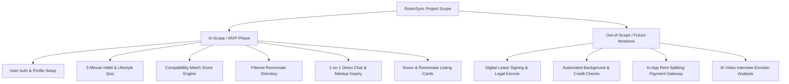
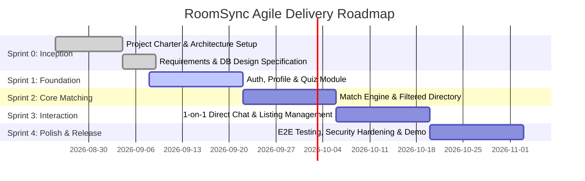

# Project Charter: Behavior-Based Roommate Matching Platform

| **Document Information** | **Details** |
| :--- | :--- |
| **Project Name** | RoomSync (Behavior-Based Roommate Matching Web App) |
| **Course Code / Name** | 192-304 Agile Software Development |
| **Project Sponsor / Lecturer**| Krissada Chalermsook (Oak) |
| **Document Version** | 1.0.0 |
| **Date of Creation** | August 2026 |
| **Project Status** | Approved / Sprint Planning Phase |

---

## 1. Executive Summary

Finding a compatible roommate is one of the most stressful challenges faced by university students and young urban renters. Traditional rental platforms and unstructured social media groups prioritize room photos and rental pricing while ignoring daily lifestyle routines, personal habits, and co-living standards. This information gap frequently causes interpersonal conflicts, broken leases, and mental distress.

**RoomSync** is a modern, responsive web application developed using Agile/Scrum and Lean Startup principles. It shifts the roommate search from superficial criteria to **behavioral compatibility**. Through an interactive 2-minute lifestyle assessment, intelligent compatibility scoring, filtered candidate discovery, and direct 1-on-1 messaging, RoomSync helps renters find roommates with aligned sleep schedules, cleanliness standards, guest expectations, and noise tolerance before signing a lease.

---

## 2. Project Vision & Purpose

### 2.1 Vision Statement
> *"To eliminate co-living friction and foster harmonious shared housing by connecting roommates through transparent, behavior-first compatibility matching and intelligent lifestyle screening."*

### 2.2 Problem Statement
From the Design Thinking Empathize and Define phases, three critical pain points were identified:
1. **Sleep Cycle Friction:** Clashes between early risers and late-night gamers/workers cause daily noise disruptions and sleep deprivation.
2. **Cleaning Standard Mismatch:** Inconsistent chore habits, dishwashing delays, and divergent definitions of "clean" lead to ongoing shared-space resentment.
3. **Screening Discomfort:** Users feel awkward asking direct, sensitive personal questions (guest rules, party habits, pet care, smoking) in initial direct messages.
4. **Unstructured & Inefficient Search:** Room posters waste hours sorting through disorganized social media DMs without pre-filtered applicant lifestyle data.

### 2.3 Value Proposition & Strategic Fit
- **Core Problem Fit:** Directly solves day-to-day lifestyle compatibility rather than merely indexing price and room dimensions.
- **Organic Growth Potential:** High user incentive to share personalized profile match badges and quiz links in university portals and housing groups.
- **Scalable & Repeatable:** The lifestyle matching framework seamlessly generalizes across different cities, university campuses, and rental markets with a recurring user cycle as leases renew.

---

## 3. Business & Project Objectives (SMART)

1. **Specific:** Develop and deploy a full-stack Minimum Viable Product (MVP) web application featuring a 2-minute habit quiz, multi-factor compatibility percentage scoring, filtered roommate directory, and real-time 1-on-1 direct chat.
2. **Measurable:**
   - Onboard at least 50 student/renter beta profiles during the pilot testing phase.
   - Achieve $\ge 85\%$ user satisfaction on match accuracy during usability evaluations.
   - Maintain API response latency $\le 250\text{ ms}$ and $\ge 80\%$ automated test coverage across core modules.
3. **Achievable:** Implement incrementally across 4 two-week Sprints leveraging Agile Scrum practices and AI-assisted engineering workflows.
4. **Relevant:** Directly resolves student and urban living pain points discovered in user research and fulfills the curriculum goals of Agile Software Development (192-304).
5. **Time-bound:** Finalize MVP development, acceptance testing, and release within the 18-week academic semester schedule.

---

## 4. Scope Management

### 4.1 In-Scope (MVP Phase)
- **User Authentication & Profile:** Secure email/password registration, JWT session management, profile bio, budget, target move-in date, and location preferences.
- **Habit & Lifestyle Quiz (2-Min Assessment):** Structured questions capturing sleep schedule (early bird vs night owl), cleanliness index (1–5 scale), guest frequency policy, noise/party tolerance, and smoking/pet rules.
- **Compatibility Scoring Engine:** Algorithmic calculation of a 0–100% compatibility score between any two users based on weighted lifestyle attributes with visual habit tag comparisons.
- **Filtered Roommate Directory:** Searchable directory allowing users to filter candidate profiles by budget range, location/university district, gender preference, and minimum compatibility score (e.g., $\ge 80\%$).
- **1-on-1 Direct Chat System:** Messaging interface enabling matched users to safely discuss room arrangements, set house rules, and coordinate in-person or virtual meetups.
- **Listing Management:** Capability for users to flag whether they "Have a Room" (posting a vacancy) or "Need a Room" (looking for a co-tenant).

### 4.2 Out-of-Scope (Future Sprints & Post-MVP)
- Integrated online legal lease generation and e-signatures.
- Third-party credit checks and criminal background verification APIs.
- In-app utility bill splitting and rent escrow payment gateways.
- Native iOS/Android mobile apps (MVP is fully mobile-responsive web).

---

## 5. Agile Scrum Roles & Team Structure

| Role | Assigned Name | Core Responsibilities |
| :--- | :--- | :--- |
| **Product Owner (PO)** | Product Owner Lead | Owns product vision, manages Product Backlog, writes user stories, defines acceptance criteria, accepts/rejects Sprint increments. |
| **Scrum Master (SM)** | Scrum Master Lead | Facilitates Daily Standups, Sprint Planning, Reviews, and Retrospectives; removes blockers and tracks sprint burndown/velocity. |
| **Full-Stack Development Team** | Development Engineers & QA | Implements UI components, backend APIs, database schemas, matching algorithms, test automation, and CI/CD pipelines. |
| **Key Stakeholders** | Course Instructor, University Students, Urban Renters | Provide feedback during Sprint Reviews, participate in user interviews, and validate usability during acceptance testing. |

---

## 6. Sprint Roadmap & Key Milestones

| Milestone / Sprint | Focus Area | Key Deliverables | Timeline |
| :--- | :--- | :--- | :--- |
| **Sprint 0: Inception & Design** | Discovery & Specifications | Project Charter, SRS, Acceptance Criteria, Database Design, Git repo setup | Weeks 1–2 |
| **Sprint 1: Auth & Habit Quiz** | Account & Assessment System | JWT Auth, User Profiles, 2-Minute Habit & Lifestyle Assessment Quiz | Weeks 3–5 |
| **Sprint 2: Match Engine & Directory** | Algorithmic Matching & Discovery | % Compatibility Algorithm, Filtered Roommate Directory, Lifestyle Comparison Badges | Weeks 6–9 |
| **Sprint 3: Direct Messaging & Listings** | Communication & Housing Posts | 1-on-1 Direct Chat, Listing Management (Have/Need a Room), Meetup scheduler | Weeks 10–13 |
| **Sprint 4: Testing & MVP Release** | Hardening & Production Deploy | Automated E2E Tests, Performance Optimization, Cloud Deployment & Demo Day | Weeks 14–18 |

---

## 7. Assumptions, Constraints & Dependencies

### 7.1 Assumptions
- Users are willing to spend 2 minutes answering honest behavioral questions to improve match quality.
- Users access the platform via modern web browsers on smartphones, tablets, or laptops.
- The matching algorithm can produce meaningful compatibility scores without requiring hundreds of complex inputs.

### 7.2 Constraints
- **Time Constraint:** 4 bi-weekly development Sprints within the academic term.
- **Budget Constraint:** Utilizing zero-cost / open-source cloud infrastructure tiers (e.g., PostgreSQL, Supabase/Render, Vercel).
- **Privacy & Security:** Strict protection of personal contact information; private chat and contact info revealed only upon mutual user consent.

### 7.3 Dependencies
- Relational Database Management System (PostgreSQL / SQLite).
- WebSocket or polling infrastructure for real-time direct chat messaging.
- Cloud image hosting (Cloudinary / AWS S3 / Supabase Storage) for profile and room photos.

---

## 8. Risk Management Matrix (VUCA Approach)

| Risk Event | Category | Impact | Likelihood | Mitigation Strategy |
| :--- | :--- | :---: | :---: | :--- |
| **Dishonest Quiz Responses** | Volatility | High | Medium | Add clear guidance explaining that honest answers prevent future lease disputes; include mutual deal-breaker confirmation. |
| **Cold Start / Sparse User Density** | Ambiguity | High | Medium | Seed realistic local demo profiles for pilot testing; focus launch on specific university clusters. |
| **Real-Time Chat Latency / Message Drops** | Complexity | Medium | Low | Use standard WebSocket architecture with fallback REST polling and persistent database message storage. |
| **Scope Creep in Sprints** | Uncertainty | High | Medium | Strict adherence to MoSCoW prioritization; enforce Definition of Ready (DoR) and Definition of Done (DoD). |
| **Privacy / Harassment Concerns** | Complexity | High | Low | Implement profile block/report mechanisms, keep personal phone numbers hidden by default, and provide in-app chat only. |

---

## 9. Charter Authorization & Sign-off

| Stakeholder Role | Name | Status | Date |
| :--- | :--- | :---: | :--- |
| **Product Owner** | Product Owner Representative | **Approved** | 29/08/2026 |
| **Scrum Master** | Scrum Master Representative | **Approved** | 29/08/2026 |
| **Lead Developer** | Development Team Representative | **Approved** | 29/08/2026 |
