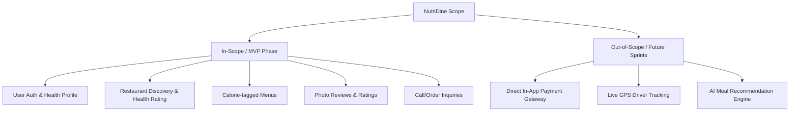

# Project Charter: NutriDine Platform

| **Document Information** | **Details** |
| :--- | :--- |
| **Project Name** | NutriDine (Healthy Restaurant Discovery & Calorie Tracker) |
| **Course Code / Name** | 192-304 Agile Software Development |
| **Project Sponsor / Lecturer**| Krissada Chalermsook (Oak) |
| **Document Version** | 1.0.0 |
| **Date of Creation** | August 2026 |
| **Project Status** | Approved / Sprint Planning Phase |

---

## 1. Executive Summary

In today's fast-paced urban environment, finding restaurant meals that fit specific dietary goals and nutritional requirements is difficult. Consumers often struggle with misleading food photos, unclear calorie content, and high-fat options. **NutriDine** is a modern, responsive web platform developed under Lean Startup and Agile/Scrum methodologies. It bridges health-conscious diners with nearby restaurants offering calorie-conscious, obesity-friendly menus with verified nutritional information and community reviews.

---

## 2. Project Vision & Purpose

### 2.1 Vision Statement
> *"To empower individuals to make healthier nutritional choices effortlessly by connecting them with transparent, calorie-conscious local restaurants through community-driven insights and Agile software innovation."*

### 2.2 Problem Statement
- **Information Asymmetry:** Consumers cannot accurately assess nutritional metrics (calories, fats, proteins) when dining out or ordering food.
- **Misleading Food Presentation:** Online photos frequently diverge from actual portion sizes and ingredients ("picture does not match the cover").
- **Lack of Health-Centric Discovery:** Existing food delivery/review apps prioritize sponsored rankings over health and wellness criteria.

---

## 3. Business & Project Objectives (SMART)

1. **Specific:** Deliver a full-stack Minimum Viable Product (MVP) web application enabling restaurant discovery by calorie range and health score, menu browsing, photo reviews, and order inquiries.
2. **Measurable:**
   - Onboard at least 30 verified restaurants in the pilot launch area.
   - Achieve 95%+ test coverage on core API modules.
   - Maintain a page load time of under 1.5 seconds on 4G mobile networks.
3. **Achievable:** Implement incrementally across 4 two-week Sprints using AI-assisted pair programming (Antigravity CLI / GitHub Copilot CLI).
4. **Relevant:** Directly solves urban dietary pain points identified during the Design Thinking Empathize & Define phases.
5. **Time-bound:** Complete MVP development, user acceptance testing, and final deployment within the academic semester timeframe.

---

## 4. Scope Management

### 4.1 In-Scope (MVP Phase)
- **User Authentication & Profile:** Secure sign-up/login, daily calorie budget settings.
- **Restaurant Discovery:** Geolocation-based search, filtering by health score ("Obesity-friendly score") and dietary categories.
- **Nutritional Menu System:** Menu items with calorie counts, protein/carb/fat macro splits, and allergen tags.
- **Community Ratings & Photo Reviews:** User-submitted reviews with photos and authentic dish ratings.
- **Direct Ordering / Contact:** Direct telephone dialing, inquiry submission, and merchant WhatsApp/Line integration.
- **Merchant Management Portal:** Self-service dashboard for restaurant managers to update menu items and calorie information.

### 4.2 Out-of-Scope (Future Iterations)
- Integrated in-app multi-currency payment gateways (Stripe/Credit Cards) — handled via direct merchant payment in MVP.
- Real-time automated rider dispatch and live map GPS tracking.
- AI-driven automated computer vision calorie recognition from arbitrary food photos.

---

## 5. Agile Scrum Roles & Team Structure

| Role | Assigned Name | Core Responsibilities |
| :--- | :--- | :--- |
| **Product Owner (PO)** | Krissada / Lead Student | Defines product vision, authors and prioritizes User Stories, manages Product Backlog, accepts/rejects Sprint increments. |
| **Scrum Master (SM)** | Paween / Student SM | Facilitates Scrum ceremonies, removes development impediments, coaches team on Agile values and velocity tracking. |
| **Development Team** | Full-Stack Engineers & QA | Cross-functional team responsible for UI/UX, backend API design, database schemas, test automation, and deployment. |
| **Key Stakeholders** | Course Instructors, Health-conscious Users, Restaurant Owners | Provide feedback during Sprint Reviews, participate in usability testing and product demos. |

---

## 6. Sprint Roadmap & Key Milestones

| Milestone / Sprint | Focus Area | Key Deliverables | Timeline |
| :--- | :--- | :--- | :--- |
| **Sprint 0: Orientation & Setup** | Project Inception & Design Thinking | Project Charter, Requirements Spec, Database Design, Repo Setup | Week 1–2 |
| **Sprint 1: Core Foundation** | Authentication & Profile Management | User Auth (JWT), Database Migrations, Health Profile setup | Week 3–5 |
| **Sprint 2: Discovery & Menu** | Search, Filters & Nutrition Catalog | Restaurant listing, Calorie filter, Menu detail view | Week 6–9 |
| **Sprint 3: Community & Orders** | Reviews, Photos & Contact Action | Review submission with photo uploads, Call-to-order flow | Week 10–13 |
| **Sprint 4: Hardening & Release** | Polish, Testing, Security & Demo | Performance tuning, E2E testing, Final Demo Day Release | Week 14–18 |

---

## 7. Assumptions, Constraints & Dependencies

### 7.1 Assumptions
- End users have internet-connected smartphones or desktop web browsers.
- Participating pilot restaurants will provide baseline nutritional and calorie estimations for their menu items.
- Modern AI CLI tools will assist in rapid prototyping and high-quality test generation.

### 7.2 Constraints
- **Time Constraint:** 4 Sprints of 2 weeks each to deliver full working software.
- **Budget Constraint:** Utilizing open-source and free-tier infrastructure (PostgreSQL, Supabase/Render/Vercel).
- **Compliance:** Protection of user profile data following modern privacy and security best practices.

### 7.3 Dependencies
- Cloud database hosting availability.
- Third-party image storage (Cloudinary / S3 bucket) for review photo attachments.

---

## 8. Risk Management Matrix (VUCA Approach)

| Risk Event | Severity | Likelihood | Mitigation Strategy |
| :--- | :---: | :---: | :--- |
| **Scope Creep during Sprints** | High | Medium | Strict adherence to Product Backlog refinement; non-MVP features deferred to post-release backlog. |
| **Inaccurate Calorie Data** | Medium | High | Display disclaimer banners; allow community members to suggest calorie corrections. |
| **API Response Latency under Load** | Medium | Low | Implement Redis caching for restaurant catalogs and index geospatial database queries. |
| **Team Velocity Fluctuations** | Medium | Medium | Track sprint burndown charts closely; re-estimate story points during mid-sprint check-ins. |

---

## 9. Charter Authorization & Sign-off

| Stakeholder Role | Name | Signature / Status | Date |
| :--- | :--- | :--- | :--- |
| **Product Owner** | Product Owner Rep | **Approved** | 29/08/2026 |
| **Scrum Master** | Scrum Master Rep | **Approved** | 29/08/2026 |
| **Lead Developer** | Development Team Rep | **Approved** | 29/08/2026 |

