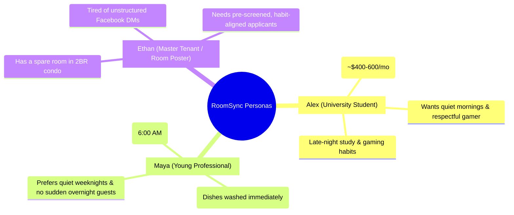
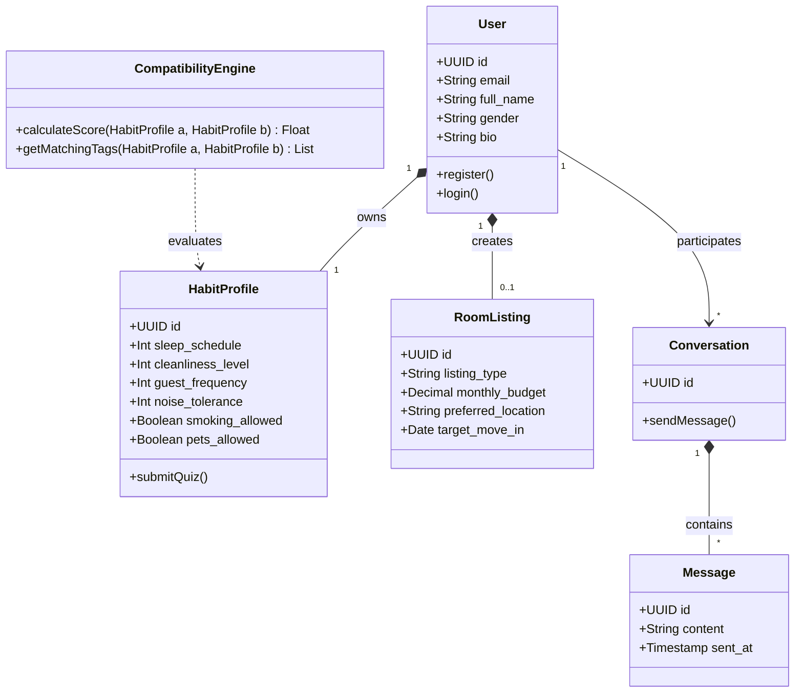

# Software Requirements Specification (SRS)

## RoomSync Platform (Behavior-Based Roommate Matching Web App)
**Document Version:** 1.0.0  
**Course:** 192-304 Agile Software Development  
**Date:** August 2026  
**Status:** Approved  

---

## 1. Introduction

### 1.1 Purpose
This Software Requirements Specification (SRS) defines the complete functional, non-functional, and interface requirements for **RoomSync**, a behavior-driven roommate matching web platform built under Agile/Scrum methodology. The system eliminates co-living friction by prioritizing lifestyle habits (sleep cycles, cleanliness, guest rules, noise tolerance) over purely physical housing attributes.

### 1.2 Scope of the System
RoomSync provides a responsive web application that enables users to:
1. Complete an engaging 2-minute habit and lifestyle assessment.
2. Receive transparent, percentage-based compatibility match scores with candidate roommates.
3. Browse a filtered directory of potential roommates and room listings by budget, location, and compatibility threshold.
4. Safely communicate via an in-app 1-on-1 direct messaging system to discuss living boundaries and arrange meetings.

### 1.3 Definitions, Acronyms, and Abbreviations
- **SRS:** Software Requirements Specification
- **MVP:** Minimum Viable Product
- **BCM:** Behavioral Compatibility Matcher
- **BDD:** Behavior-Driven Development
- **JWT:** JSON Web Token
- **MoSCoW:** Must have, Should have, Could have, Won't have
- **DoD:** Definition of Done
- **DoR:** Definition of Ready

---

## 2. Overall Description

### 2.1 User Personas

1. **Persona 1: "Alex" (Student / Night Owl):** Needs a roommate who will not complain about late-night keyboard typing and values flexible chore rotations.
2. **Persona 2: "Maya" (Young Professional / Early Bird):** Needs a neat, organized co-tenant who respects quiet hours after 10:00 PM and shares cleaning duties equally.
3. **Persona 3: "Ethan" (Room Poster / Sublessor):** Wants to quickly filter 20+ applicants by compatibility percentage to find someone who fits his apartment's established quiet and guest rules.

### 2.2 Product Perspective & Conceptual Architecture

### 2.3 Operating Environment
- **Client Tier:** Modern desktop and mobile web browsers (Chrome 120+, Safari 17+, Firefox 120+, Edge 120+).
- **Application Server Tier:** Node.js (Express / NestJS) or Python (FastAPI) runtime.
- **Database Tier:** PostgreSQL 16+ / SQLite 3.35+ with indexed relational schema.

---

## 3. Functional Requirements (FR)

The requirements are prioritized using the **MoSCoW** classification framework.

### 3.1 Module 1: User Authentication & Personal Profile (UAP)
- **FR-1.1 [Must Have]:** The system shall allow users to register an account with a valid email and password (minimum 8 characters, hashed securely).
- **FR-1.2 [Must Have]:** The system shall authenticate registered users using secure JWT session tokens with auto-expiration.
- **FR-1.3 [Must Have]:** The system shall allow users to build a personal profile including display name, avatar photo, gender preference, occupation/university, and a short bio.
- **FR-1.4 [Should Have]:** The system shall allow users to toggle their search status (e.g., "Actively Looking", "Found Roommate", "Hidden").

### 3.2 Module 2: 2-Minute Habit & Lifestyle Assessment Quiz (HLA)
- **FR-2.1 [Must Have]:** The system shall present a multi-step interactive lifestyle questionnaire covering:
  - **Sleep Cycle:** Early Bird (wake $\le$ 7 AM, sleep $\le$ 11 PM) vs. Night Owl (wake $\ge$ 9 AM, sleep $\ge$ 1 AM) vs. Flexible.
  - **Cleanliness Standard:** Discrete scale 1 to 5 (1 = Relaxed/Casual, 5 = Deep Clean & Spotless Daily).
  - **Guest Policy:** 1 (Rarely/Never), 2 (Occasional weekends), 3 (Frequent overnight guests welcome).
  - **Noise & Social Tolerance:** 1 (Quiet sanctuary), 2 (Moderate/Music with headphones), 3 (Lively/Social gatherings).
  - **Deal-Breakers:** Smoking habits (Non-smoker only vs. Smoker friendly) and Pet preferences (Pet allergy/No pets vs. Pet lover).
- **FR-2.2 [Must Have]:** The system shall allow users to update their quiz answers at any time and automatically recalculate match scores.
- **FR-2.3 [Should Have]:** The system shall display estimated completion time ($\le 2$ minutes) and a progress indicator bar during the quiz.

### 3.3 Module 3: Compatibility Matching Engine (CME)
- **FR-3.1 [Must Have]:** The system shall calculate a weighted compatibility percentage ($0\%$ to $100\%$) between any two users who have completed the habit quiz.
- **FR-3.2 [Must Have]:** The system shall display visual compatibility badges highlighting aligned habits (e.g., *"Both Night Owls"*, *"Matching Cleanliness Standard"*, *"Both Pet-Friendly"*).
- **FR-3.3 [Should Have]:** The system shall display a category-by-category breakdown radar/bar chart (Sleep, Cleanliness, Social, House Rules) on user profile view.
- **FR-3.4 [Must Have]:** If two users possess conflicting hard deal-breakers (e.g., Smoker vs. Strict Non-Smoker), the system shall flag a visible warning indicator on the profile card.

### 3.4 Module 4: Filtered Roommate Directory & Discovery (FRD)
- **FR-4.1 [Must Have]:** The system shall provide a searchable directory of roommate candidates with cards showing photo, name, match %, budget, location, and key habit tags.
- **FR-4.2 [Must Have]:** The system shall allow filtering by:
  - Minimum Compatibility Score (e.g., $\ge 70\%$, $\ge 80\%$, $\ge 90\%$)
  - Monthly Budget Range ($\text{Min}$ – $\text{Max}$)
  - Preferred Target Location / University Area
  - Move-in Date Window
  - Housing Status ("Has Room" vs "Needs Room")
- **FR-4.3 [Should Have]:** The system shall support sorting by highest compatibility percentage, lowest budget, or newest joined.

### 3.5 Module 5: 1-on-1 Direct Messaging & Inquiry (DMI)
- **FR-5.1 [Must Have]:** Authenticated users shall be able to initiate a private 1-on-1 conversation with any candidate from their profile or directory card.
- **FR-5.2 [Must Have]:** The system shall display message history chronologically with sender name, message body, and delivery timestamps.
- **FR-5.3 [Should Have]:** The system shall provide pre-written conversation starters tailored to matching lifestyle points (e.g., *"Hey, saw we're both night owls looking around Downtown!"*).
- **FR-5.4 [Must Have]:** The system shall allow users to block or report inappropriate profiles directly from the chat interface.

### 3.6 Module 6: Room & Sublease Postings (LMG)
- **FR-6.1 [Must Have]:** Users who have an available room shall be able to create a listing card with rent price, room photos, address/district, and move-in availability date.
- **FR-6.2 [Must Have]:** Room seekers shall be able to browse available rooms filtered by price and compatibility with the existing master tenant.

---

## 4. Non-Functional Requirements (NFR)

| Category | ID | Requirement Specification | Target Metric |
| :--- | :--- | :--- | :--- |
| **Performance** | NFR-1 | Page Load Time for Directory & Profile views | $\le 1.2\text{ seconds}$ on standard 4G mobile |
| **Performance** | NFR-2 | Matching Score Calculation Latency | $\le 150\text{ ms}$ for real-time score rendering |
| **Performance** | NFR-3 | Direct Message Delivery Latency | $\le 500\text{ ms}$ end-to-end message propagation |
| **Security** | NFR-4 | Password Storage & Data Encryption | Passwords hashed via Bcrypt (salt rounds $\ge 10$), TLS 1.3 enforced, JWT signed via HMAC-SHA256 |
| **Privacy** | NFR-5 | Contact Information Masking | Phone numbers and exact apartment addresses remain private until users exchange messages |
| **Reliability** | NFR-6 | System Availability | $99.9\%$ uptime during test and evaluation periods |
| **Usability** | NFR-7 | Mobile Responsiveness | Fully functional and touch-friendly across viewport widths $360\text{px}$ to $1920\text{px}$ |
| **Maintainability**| NFR-8 | Test Coverage & Code Quality | $\ge 80\%$ automated unit and integration test coverage |

---

## 5. External Interface Requirements

### 5.1 User Interface (UI) Design Guidelines
- Clean, trustworthy, and modern design aesthetic with indigo/violet primary accents and teal compatibility highlights.
- Clear visual cues: High compatibility ($\ge 80\%$) in Vibrant Green, Moderate ($60\text{--}79\%$) in Amber, and Low ($< 60\%$) in Slate Grey.
- Mobile-first bottom navigation bar for quick access: Discover, Messages, My Room/Listing, Profile.

### 5.2 Software Interfaces
- **Cloud Object Storage:** Supabase Storage / AWS S3 / Cloudinary REST API for user profile avatars and room images.
- **Database Engine:** PostgreSQL 16 connection via standard connection pooling.

---

## 6. Requirements Traceability Matrix

| Requirement ID | Module Name | Sprint Target | Verification Method |
| :--- | :--- | :---: | :--- |
| **FR-1.1, FR-1.2, FR-1.3** | User Authentication & Profile | Sprint 1 | Automated Auth Unit Tests & JWT Integration Tests |
| **FR-2.1, FR-2.2, FR-2.3** | 2-Minute Habit Quiz | Sprint 1 | Frontend Component Tests & Quiz State Validation |
| **FR-3.1, FR-3.2, FR-3.4** | Compatibility Engine | Sprint 2 | Algorithm Unit Tests with Edge-Case Matrices |
| **FR-4.1, FR-4.2, FR-4.3** | Filtered Directory & Search | Sprint 2 | Directory Filter Tests & Mock Dataset Benchmarks |
| **FR-5.1, FR-5.2, FR-5.4** | 1-on-1 Direct Messaging | Sprint 3 | Chat Delivery E2E Tests & Block/Report Verification |
| **FR-6.1, FR-6.2** | Room Listing Management | Sprint 3 | Listing CRUD API Tests & Image Attachment Checks |
