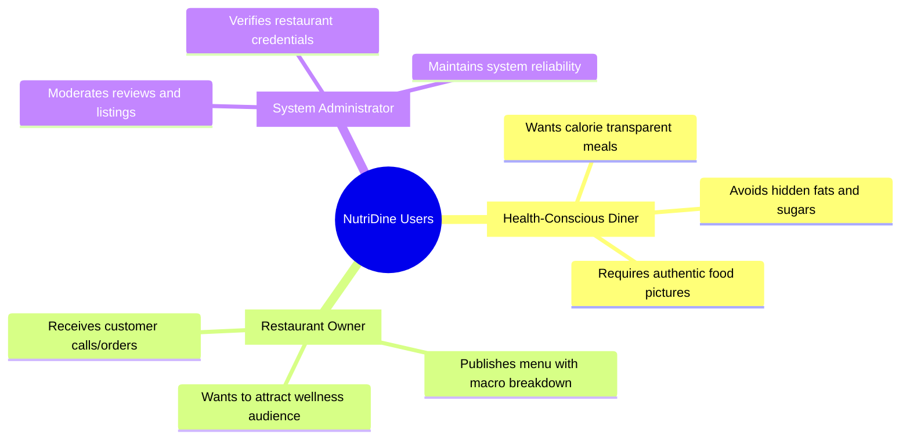
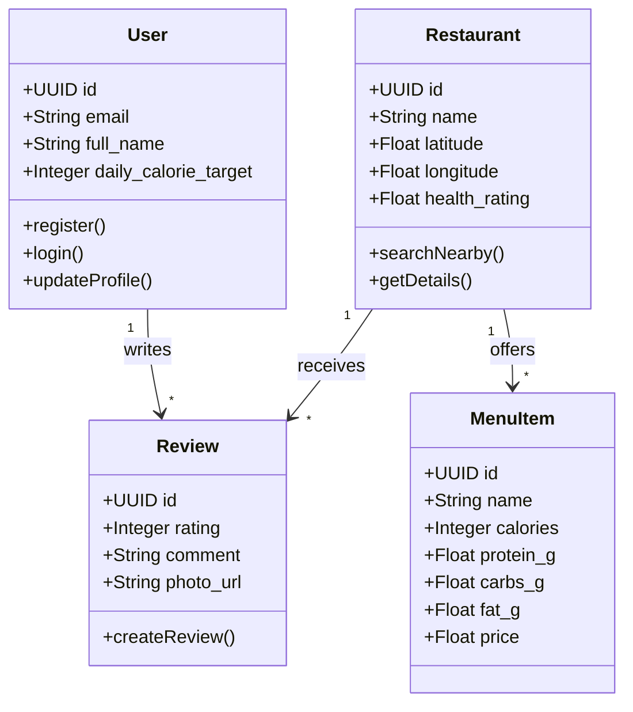

# Software Requirements Specification (SRS)

## NutriDine Platform
**Document Version:** 1.0.0  
**Course:** 192-304 Agile Software Development  
**Date:** August 2026  
**Status:** Approved  

---

## 1. Introduction

### 1.1 Purpose
This Software Requirements Specification (SRS) captures the functional, non-functional, and interface requirements for **NutriDine**, an Agile/Scrum-developed web platform designed to facilitate healthy eating through transparent nutritional disclosure, calorie-aware restaurant discovery, and community food reviews.

### 1.2 Scope of the System
NutriDine delivers an intuitive, mobile-responsive web application that enables consumers to discover restaurants by nutritional metrics (calories, fat rating, dietary preferences), view itemized nutritional menus, write verified photo reviews, and directly place inquiries or phone orders.

### 1.3 Definitions, Acronyms, and Abbreviations
- **SRS:** Software Requirements Specification
- **MVP:** Minimum Viable Product
- **BMR / TDEE:** Basal Metabolic Rate / Total Daily Energy Expenditure
- **JWT:** JSON Web Token
- **MoSCoW:** Must have, Should have, Could have, Won't have (Prioritization framework)
- **DoD:** Definition of Done

---

## 2. Overall Description

### 2.1 User Personas

1. **Persona A (Health-Conscious Diner - "Sarah"):** Needs quick access to low-calorie lunch options nearby (within 5km), with trustworthy photos and clear calorie/macro breakdowns.
2. **Persona B (Healthy Restaurant Owner - "Chef David"):** Wants a direct channel to showcase his clean-eating recipes, update daily caloric counts, and receive direct phone orders without exorbitant delivery commissions.
3. **Persona C (Platform Moderator / Admin):** Manages user moderation, verifies restaurant authenticity, and enforces content safety standards.

### 2.2 Operating Environment
- **Client Tier:** Modern web browsers (Chrome 120+, Safari 17+, Firefox 120+, Edge 120+) across desktop, tablet, and mobile viewports.
- **Application Server Tier:** Node.js / Python FastAPI runtime environment.
- **Database Tier:** PostgreSQL / SQLite with indexed queries.

---

## 3. Functional Requirements (FR)

The requirements are prioritized using the **MoSCoW** classification.

### 3.1 Module 1: User Authentication & Profile (UAP)
- **FR-1.1 [Must Have]:** The system shall allow users to register an account using a unique email address and secure password (minimum 8 characters, hashed using bcrypt/argon2).
- **FR-1.2 [Must Have]:** The system shall allow registered users to authenticate and receive a secure JWT session token.
- **FR-1.3 [Should Have]:** The system shall allow users to set and update their daily calorie budget and dietary preferences (e.g., Low-Fat, Keto, Vegan, High-Protein).

### 3.2 Module 2: Restaurant Discovery & Geolocation (RDG)
- **FR-2.1 [Must Have]:** The system shall allow users to search restaurants by name, address, or current GPS coordinates.
- **FR-2.2 [Must Have]:** The system shall allow filtering of restaurants based on health/obesity-friendly score (1 to 5 stars) and maximum distance in kilometers.
- **FR-2.3 [Should Have]:** The system shall display restaurants on an interactive card list sorted by proximity or health rating.

### 3.3 Module 3: Nutritional Menu Catalog (NMC)
- **FR-3.1 [Must Have]:** The system shall display each restaurant’s menu with dish names, pricing, and explicit calorie counts.
- **FR-3.2 [Must Have]:** The system shall display macronutrient details (Protein, Carbohydrates, Total Fat in grams) for each menu item.
- **FR-3.3 [Should Have]:** The system shall highlight dishes that fit within the logged-in user’s remaining daily calorie target.

### 3.4 Module 4: Reviews & Real Photo Verification (RPV)
- **FR-4.1 [Must Have]:** Authenticated users shall be able to rate a restaurant (1 to 5 stars) and submit text reviews.
- **FR-4.2 [Must Have]:** Users shall be able to upload real photos of dishes to prevent "expectation vs reality" discrepancies.
- **FR-4.3 [Should Have]:** The system shall calculate and update a restaurant’s aggregate health rating based on verified customer feedback.

### 3.5 Module 5: Direct Ordering & Inquiries (DOI)
- **FR-5.1 [Must Have]:** The system shall provide a direct click-to-call button with the restaurant's phone number on mobile and desktop viewports.
- **FR-5.2 [Should Have]:** The system shall allow users to create a pre-filled order inquiry summary (selected dishes + total calories) to send via chat/call.

---

## 4. Non-Functional Requirements (NFR)

| Category | ID | Requirement Specification | Metrics / Target |
| :--- | :--- | :--- | :--- |
| **Performance** | NFR-1 | Page load time across all core views | $\le 1.5$ seconds under standard 4G mobile connection |
| **Performance** | NFR-2 | Backend REST API response latency | $95^{th}$ percentile response time $\le 300$ ms |
| **Security** | NFR-3 | Authentication & Data Encryption | Passwords hashed with bcrypt (cost factor $\ge 10$); JWT tokens signed with SHA-256; TLS 1.3 enforced |
| **Reliability** | NFR-4 | Application availability and uptime | 99.9% uptime during operational testing hours |
| **Usability** | NFR-5 | Responsive UI design across device form factors | Fully functional on viewport widths from 360px (mobile) to 1920px (desktop) |
| **Maintainability**| NFR-6 | Code Quality & Unit Test Coverage | Minimum 80% automated test coverage for business logic |

---

## 5. External Interface Requirements

### 5.1 User Interface (UI)
- Clean, health-focused visual palette (emerald green, soft slate, warm amber).
- Intuitive navigation bar: Search / Discover, My Health Target, Bookmarks, and User Account.

### 5.2 Software Interfaces
- **Storage Service:** Cloudinary / S3-compatible REST API for photo upload hosting.
- **Geolocation API:** HTML5 Geolocation API for device coordinate capture.

---

## 6. Requirements Traceability Matrix

| Requirement ID | Module Name | Sprint Target | Test Verification Method |
| :--- | :--- | :---: | :--- |
| **FR-1.1, FR-1.2** | User Authentication | Sprint 1 | Automated Unit & Integration Tests (Auth API) |
| **FR-1.3** | User Health Profile | Sprint 1 | Component UI Tests & Profile API Tests |
| **FR-2.1, FR-2.2** | Restaurant Discovery | Sprint 2 | Geolocation query tests & Filter API tests |
| **FR-3.1, FR-3.2** | Nutritional Menu Catalog | Sprint 2 | Menu retrieval benchmarks & schema validation |
| **FR-4.1, FR-4.2** | Reviews & Photo Uploads | Sprint 3 | Multipart form upload tests & moderation flow |
| **FR-5.1, FR-5.2** | Direct Order / Call Flow | Sprint 3 | Mobile browser interaction & E2E smoke tests |

